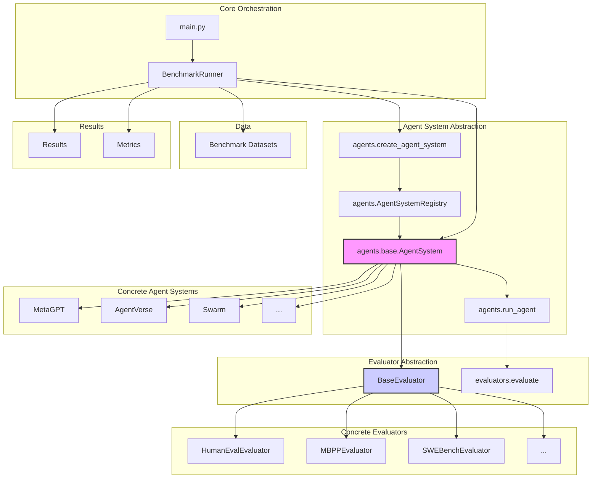

# MAS Arena

A comprehensive framework for benchmarking single and multi-agent systems across a wide range of tasks—evaluating performance, accuracy, and efficiency with built-in visualization and tool integration.


---
<!-- TOC -->


- [MAS Arena](#mas-arena)
  - [🚀 Quick Start](#-quick-start)
    - [1. Setup](#1-setup)
    - [2. Configure Environment Variables](#2-configure-environment-variables)
  - [🧪 Running Benchmarks](#-running-benchmarks)
    - [Option 1: Using `main.py`](#option-1-using-mainpy)
    - [Option 2: Using the Shell Runner](#option-2-using-the-shell-runner)
  - [📈 Visualizing Agent Interactions](#-visualizing-agent-interactions)
  - [📊 Supported Benchmarks](#-supported-benchmarks)
  - [🤖 Supported Agent Systems](#-supported-agent-systems)
  - [🧠 System Overview](#-system-overview)
  - [🧩 Extending the Framework](#-extending-the-framework)
    - [➕ Add a New Agent System](#-add-a-new-agent-system)
    - [➕ Add a New Benchmark Dataset](#-add-a-new-benchmark-dataset)
  - [🛠 Tool Integration](#-tool-integration)
  - [🧠 Tool Selection and Distribution](#-tool-selection-and-distribution)
  - [✅ TODOs](#-todos)

<!-- /TOC -->


## 🚀 Quick Start

### 1. Setup

We recommend using [uv](https://docs.astral.sh/uv/) for dependency and virtual environment management.

```bash
# Install dependencies
uv sync

# Activate the virtual environment
source .venv/bin/activate
```

### 2. Configure Environment Variables

Create a `.env` file in the project root and set the following:

```bash
OPENAI_API_KEY=your_openai_api_key
MODEL_NAME=gpt-4o-mini
OPENAI_API_BASE=https://api.openai.com/v1
```

---

## 🧪 Running Benchmarks

### Option 1: Using `main.py`

```bash
# Run a math benchmark with a single agent
python main.py --benchmark math --agent-system single_agent --limit 5

# Run with supervisor-based multi-agent system
python main.py --benchmark math --agent-system supervisor_mas --limit 10

# Run with swarm-based multi-agent system
python main.py --benchmark math --agent-system swarm --limit 5
```

### Option 2: Using the Shell Runner

```bash
./run_benchmark.sh math supervisor_mas 10
```

Example output:

```bash
================================================================================
Benchmark Summary
================================================================================
Agent system: swarm
Accuracy: 70.00% (7/10)
Total duration: 335125ms
Results saved to: results/math_swarm_20250616_203434.json
Summary saved to: results/math_swarm_20250616_203434_summary.json

Run visualization:
$ python benchmark/src/visualization/visualize_benchmark.py visualize \
  --summary results/math_swarm_20250616_203434_summary.json
```

---

## 📈 Visualizing Agent Interactions

```bash
python benchmark/src/visualization/visualize_benchmark.py visualize \
  --summary results/math_swarm_20250616_203434_summary.json
```

This generates an interactive visualization of agent interactions and benchmark results.

---

## 📊 Supported Benchmarks

| Benchmark   | Description                  | Dataset File               |
| ----------- | ---------------------------- | -------------------------- |
| `math`      | Mathematical problem solving | `math_test.jsonl`          |
| `humaneval` | Python code generation       | `humaneval_test.jsonl`     |
| `mbpp`      | Python programming problems  | `mbpp_test.jsonl`          |
| `gsm8k`     | Elementary math problems     | `gsm8k_test.jsonl`         |
| `drop`      | Reading comprehension        | `drop_test.jsonl`          |
| `bbh`       | Complex reasoning tasks      | `bbh_test.jsonl`           |
| `hotpotqa`  | Multi-hop question answering | `hotpotqa_test.jsonl`      |
| `ifeval`    | Instruction following        | `ifeval_test.jsonl`        |
| `aime`      | Math competition problems    | `aime_*_test.jsonl`        |
| `mmlu_pro`  | Multi-domain knowledge       | `mmlu_pro_test.jsonl`      |
| `swebench`  | Software engineering tasks   | `swebench_lite_test.jsonl` |

---

## 🤖 Supported Agent Systems

| Agent System     | File                | Description                         |
| ---------------- | ------------------- | ----------------------------------- |
| `single_agent`   | `single_agent.py`   | Single LLM agent                    |
| `supervisor_mas` | `supervisor_mas.py` | Supervisor-based multi-agent system |
| `swarm`          | `swarm.py`          | Swarm-based agent system            |
| `agentverse`     | `AgentVerse.py`     | Dynamic recruitment agent system    |
| `chateval`       | `ChatEval.py`       | Debate-based multi-agent system     |
| `evoagent`       | `EvoAgent.py`       | Evolutionary agent system           |
| `jarvis`         | `JARVIS.py`         | Task-planning agent system          |
| `metagpt`        | `MetaGPT.py`        | Code generation agent system        |

---

## 🧠 System Overview



> For more details, see the [System Overview](docs/architecture/system_overview.md).

---

## 🧩 Extending the Framework

### ➕ Add a New Agent System

1. Create a new file in `benchmark/src/agents/` (e.g., `my_agent.py`)
2. Subclass `AgentSystem` from `base.py`
3. Register your agent in `AgentSystemRegistry`
4. Import it in `__init__.py`

### ➕ Add a New Benchmark Dataset

1. Add your dataset to the `results/` directory
2. Implement a corresponding evaluator in `benchmark/src/evaluators/`
3. Add your benchmark option in `main.py`

---

## 🛠 Tool Integration

To enable tool-based agents, pass the following flags:

```bash
./run_benchmark.sh math mock_triple_agent 1 mock_mcp_config.json
```

Sample output:

```bash
[ToolIntegration] Worker 'MathAgent' received 3 tools: mock_add, mock_subtract, mock_math_solve
[ToolIntegration] Worker 'SearchAgent' received 1 tool: mock_search
[ToolIntegration] Worker 'ReasoningAgent' received 1 tool: mock_reason
```

> See [Tool Integration](docs/tools/tool_integration.md) for advanced configurations.

---

## 🧠 Tool Selection and Distribution

You can override the default tool distribution by implementing custom:

* `ToolSelector`
* `ToolIntegrationWrapper`

See [Tool Integration Docs](docs/tools/tool_integration.md) for examples.

---

## ✅ TODOs

* [ ] Add asynchronous support for model calls
* [ ] Implement failure detection in MAS workflows
* [ ] Add more benchmarks emphasizing tool usage
* [ ] Improve configuration for MAS and tool integration
