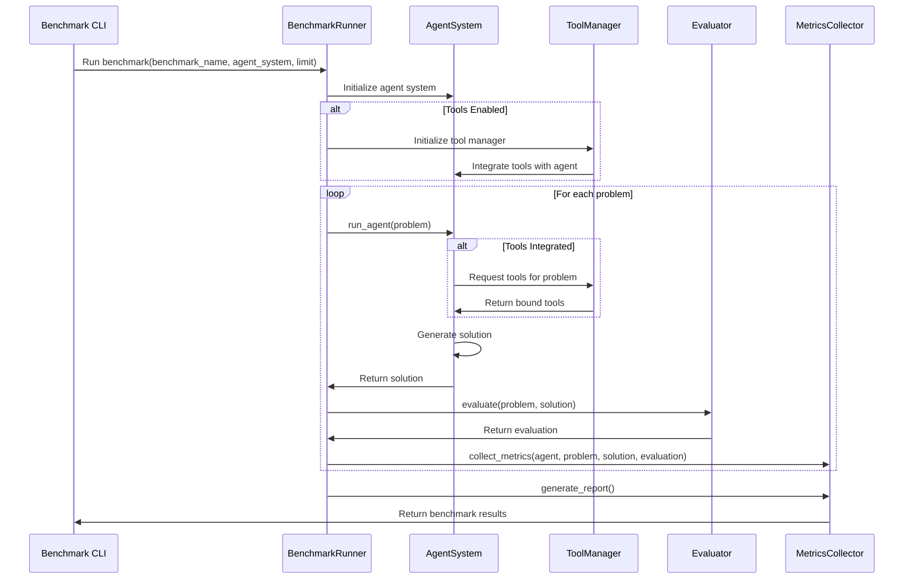

# Multi-Agent Benchmark System Architecture

This document provides an overview of the Multi-Agent Benchmark system architecture, explaining how the various components interact to benchmark different agent systems.

## System Components

The Multi-Agent Benchmark system consists of several key components:

- **Agent Systems**: Different implementations of agent architectures (single-agent, supervisor-based, swarm-based)
- **Evaluators**: Task-specific modules for evaluating agent performance
- **Tools**: External capabilities that can be integrated with agents
- **Metrics**: Collection and analysis of performance data
- **Instrumentation**: Monitoring agent behavior during benchmark execution (Future work)

## Data Flow

## Component Responsibilities

### Agent Systems

Agent systems are responsible for:

1. Implementing a specific agent architecture (single agent, multi-agent, swarm)
2. Processing benchmark problems
3. Generating solutions
4. Providing interfaces for tool integration

### Evaluators

Evaluators are responsible for:

1. Assessing the quality of agent solutions
2. Calculating performance metrics
3. Normalizing scores across different benchmarks

Evaluator implementations:

- `benchmark/src/evaluators/`: Task-specific evaluators

### Tools

The tools subsystem is responsible for:

1. Managing external tool integration with agents
2. Selecting appropriate tools for problems
3. Binding tools to agent LLMs
4. Tracking tool usage and performance

Tool-related implementations:

- `benchmark/src/tools/tool_manager.py`: Tool management and creation
- `benchmark/src/tools/tool_selector.py`: Intelligent tool selection
- `benchmark/src/tools/tool_integration.py`: Agent system tool integration

### Metrics & Instrumentation

The metrics and instrumentation subsystems are responsible for:

1. Collecting performance data during benchmark execution
2. Monitoring agent behavior
3. Tracking resource usage
4. Generating reports and visualizations

Metrics and instrumentation implementations:

- `benchmark/src/metrics/`: Metrics collection [Incomplete]
- `benchmark/src/instrumentation/`: Agent instrumentation [Incomplete]