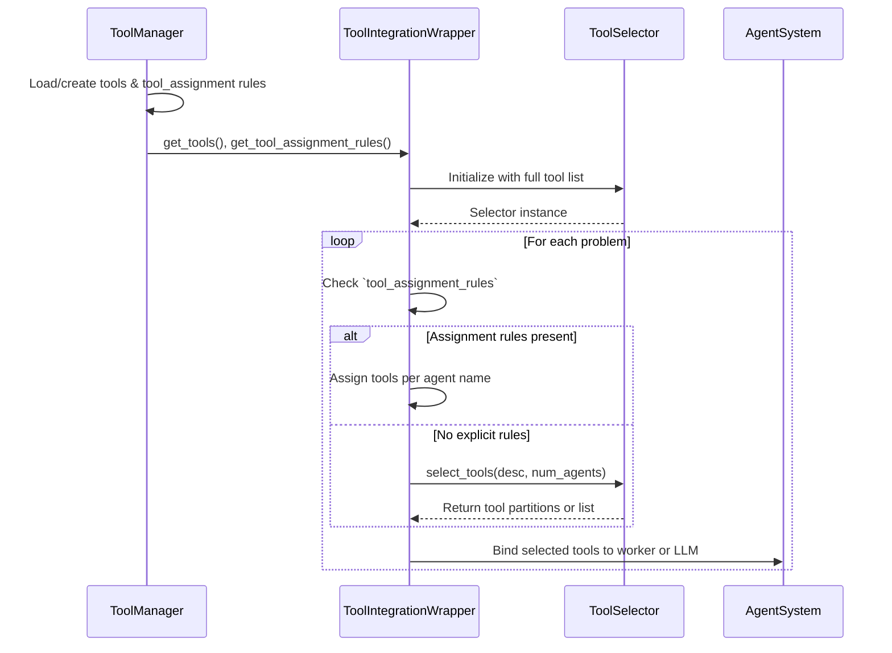

# Tool Integration System


## Overview

The tool integration system allows agent systems to leverage external tools (like calculators, search engines, or specialized APIs) to enhance their problem-solving capabilities. Tool integration is implemented through three main components:

### Components

1. **ToolManager**  
   - Loads and manages tool instances (MCP tools or mock tools).  
   - Standardizes tools into a common dictionary format via `get_tools()`.  
   - Loads optional `tool_assignment` rules from the MCP configuration and exposes them via `get_tool_assignment_rules()`.

2. **ToolSelector**  
   - Provides a single public method `select_tools(task_description, num_agents=None, overlap=False, limit=5)`.  
   - Internally uses `_select_for_task` for single-agent and `_partition_tools_for_multi_agent` for multi-agent.  
   - Deprecated wrappers for the old `select_for_task` and `partition_tools_for_multi_agent` remain for backward compatibility.  
   - Override `select_tools` to implement custom selection algorithms.

3. **ToolIntegrationWrapper**  
   - Wraps an `AgentSystem` to inject tool integration without modifying agent code.  
   - Initializes `ToolManager` and `ToolSelector` on the agent.  
   - Patches multi-agent systems by intercepting `_create_agents`, applying `tool_assignment` rules if present, or falling back to `select_tools(...)`, then binds tools to each worker LLM.  
   - Patches single-agent systems by intercepting `run_agent`, selecting tools before the run, and binding them to the agent's LLM.

## Configuration

To enable MCP tool integration in the CLI or `run_benchmark.sh`, include the flags:
```
--use-mcp-tools --mcp-config-file path/to/mcp_config.json
```
The MCP config JSON can define both server endpoints and assignment rules:

```json
{
  "math": { "command": "python", "args": ["math_server.py"], "transport": "stdio" },
  "search": { "command": "python", "args": ["search_server.py"], "transport": "stdio" },
  "tool_assignment": {
    "MathAgent": ["add", "subtract", "solve_math"],
    "SearchAgent": ["search"],
    "Reasoner": ["infer"]
  }
}
```

`ToolManager.from_config_file` will split out the `tool_assignment` section into assignment rules and treat the remaining keys as MCP server definitions.

## How They Work Together


