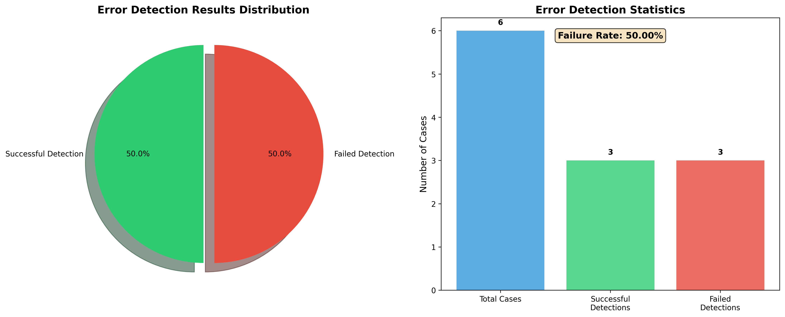

# Failure Attribution Module

This module provides automated failure attribution capabilities for analyzing multi-agent system responses and identifying failure causes. The module has been migrated and adapted from the original `Automated_FA` implementation to work with the new data format and integrated with the MAS Arena benchmark system.

## Overview

The failure attribution module analyzes agent conversation histories to identify:
- Which agent made an error
- At which step the error occurred
- What type of error it was
- The specific reason for the failure
- Error detection failure rate analysis

## Integration with MAS Arena

The failure attribution module is now fully integrated with the MAS Arena benchmark system. When running benchmarks through `benchmark_runner.py`, the system will:

1. **Automatic Collection**: Automatically collect failed agent response files from benchmark runs
2. **Centralized Storage**: Move failed responses to a timestamped directory under `results/failure/failed_responses_{timestamp}`
3. **Command Generation**: Generate ready-to-run commands for failure attribution analysis
4. **Seamless Workflow**: Provide a seamless transition from benchmark execution to failure analysis

## Migration from Automated_FA

This module has been migrated from `d:\CodeForVScode\multi_agents_benchmark\temp3\MAS\Agents_Failure_Attribution\Automated_FA` and adapted for the new data format:

### Original Data Format (Who&When)
- Used `history` field for agent interactions
- Included `ground_truth` labels for evaluation
- Had `mistake_agent` annotations

### New Data Format (agent_responses)
- Uses `responses` field for agent interactions
- No ground truth labels (unsupervised analysis)
- Includes `problem_id` and `agent_system` metadata
- Each response contains `agent_id`, `content`, and `timestamp`

### Key Adaptations
1. **Removed ground truth dependency**: All prompts have been updated to work without labeled data
2. **Enhanced context**: Added `problem_id` and `agent_system` information to prompts
3. **Focused error detection**: Optimized prompts to identify clear errors that lead to task failure
4. **Maintained three core methods**: All-at-once, step-by-step, and binary search approaches

## Installation

1. Install the required dependencies:
```bash
pip install -r requirements.txt
```

2. Set up environment variables for GPT models (if using):
```bash
# Create a .env file in the failure directory

# Option 1: Standard OpenAI API (recommended)
OPENAI_API_KEY=your_openai_api_key_here
# Optional: Custom base URL
# OPENAI_API_BASE=https://api.chatanywhere.tech

# Option 2: Azure OpenAI
# AZURE_OPENAI_API_KEY=your_azure_api_key_here
# AZURE_OPENAI_ENDPOINT=your_azure_endpoint_here
```

## Usage

### Basic Usage

The module can be run using the `inference.py` script with various analysis methods:

```bash
python inference.py --method all_at_once --model gpt-4o --directory_path ../results/agent_responses
```

### Analysis Methods

1. **All-at-once Analysis**: Analyzes the entire conversation history at once
```bash
python inference.py --method all_at_once --model gpt-4o
```

2. **Step-by-step Analysis**: Analyzes the conversation incrementally, step by step
```bash
python inference.py --method step_by_step --model gpt-4o
```

3. **Binary Search Analysis**: Uses binary search to efficiently locate errors
```bash
python inference.py --method binary_search --model gpt-4o
```

### Supported Models

#### GPT Models (Azure OpenAI)
- `gpt-4o`
- `gpt4`
- `gpt4o-mini`

Example with Standard OpenAI:
```bash
python inference.py --method all_at_once --model gpt-4o \
    --api_key your_api_key \
    --directory_path ../results/agent_responses
```

Example with Azure OpenAI:
```bash
python inference.py --method all_at_once --model gpt-4o \
    --api_key your_azure_api_key \
    --azure_endpoint your_azure_endpoint \
    --directory_path ../results/agent_responses
```

Example with Custom Base URL:
```bash
python inference.py --method all_at_once --model gpt-4o \
    --api_key your_api_key \
    --openai_base_url https://api.chatanywhere.tech \
    --directory_path ../results/agent_responses
```

#### Local Models
- `llama-8b` (meta-llama/Llama-3.1-8B-Instruct)
- `llama-70b` (meta-llama/Llama-3.1-70B-Instruct)
- `qwen-7b` (Qwen/Qwen2.5-7B-Instruct)
- `qwen-72b` (Qwen/Qwen2.5-72B-Instruct)

Example with local model:
```bash
python inference.py --method all_at_once --model llama-8b \
    --device cuda:0 \
    --directory_path ../results/agent_responses
```

### Command Line Arguments

#### Required Arguments
- `--method`: Analysis method (`all_at_once`, `step_by_step`, `binary_search`)
- `--model`: Model to use (see supported models above)

#### Optional Arguments
- `--directory_path`: Path to agent response JSON files (default: `../results/agent_responses`)
- `--api_key`: OpenAI API key (for GPT models, supports both standard and Azure)
- `--azure_endpoint`: Azure OpenAI endpoint (if using Azure OpenAI)
- `--openai_base_url`: Custom OpenAI base URL (for third-party providers)
- `--api_version`: Azure OpenAI API version (default: `2024-08-01-preview`)
- `--max_tokens`: Maximum tokens for response (default: 1024)
- `--device`: Device for local models (default: `cuda:0` if available, else `cpu`)

### Input Data Format

The module expects JSON files in the following format:

```json
{
    "problem_id": "problem_1",
    "agent_system": "multi_agent",
    "run_id": "run_123",
    "timestamp": "2024-06-24T16:11:44",
    "responses": [
        {
            "timestamp": "2024-06-24T16:11:44.123",
            "problem_id": "problem_1",
            "message_index": 0,
            "agent_id": "agent_1",
            "content": "Agent response content here...",
            "role": "assistant",
            "message_type": "response",
            "usage_metadata": {}
        }
    ]
}
```

### Output

The analysis results are saved to the `outputs/` directory with filenames in the format:
`{method}_{model}_agent_responses.txt`

Example output format:
```
Error Agent: agent_2
Error Step: 3
Error Type: Calculation Error
Reason: The agent made an arithmetic error in the calculation step.
```

## Error Detection Analysis

The `evaluate.py` script has been redesigned to analyze error detection failure rates from failure attribution results:

```bash
python evaluate.py results/failure/binary_search_gpt-4o_agent_responses_20250701_010542.json
```

### Features

- **Failure Rate Calculation**: Calculates the proportion of cases where `error_detected` is false
- **Statistical Analysis**: Provides detailed statistics including total cases, success/failure counts, and rates
- **Performance Assessment**: Evaluates model performance based on failure rates
- **Visualization**: Generates PNG charts (pie chart and bar chart) for visual analysis
- **Console Output**: Displays comprehensive analysis results in English

### Command Line Arguments

- `json_file`: Path to the JSON file containing failure attribution analysis results (required)
- `--output_dir`: Directory to save visualization charts (default: current directory)

### Output

Here is an example：



The script generates:
- Detailed console output with statistics and performance evaluation
- `error_detection_analysis.png`: Visualization chart with pie chart and bar chart
- Performance assessment based on failure rate thresholds

## Directory Structure

```
failure/
├── __init__.py
├── inference.py          # Main inference script
├── evaluate.py           # Error detection analysis script
├── requirements.txt      # Dependencies
├── README.md            # This file
├── lib/
│   ├── __init__.py
│   ├── utils.py         # GPT-based analysis functions
│   └── local_model.py   # Local model analysis functions
└── outputs/             # Generated analysis results

# Integration with MAS Arena results structure:
results/
├── agent_responses/     # Original agent response files
└── failure/
    ├── failed_responses_{timestamp}/  # Collected failed responses
    ├── {method}_{model}_agent_responses_{timestamp}.json  # Analysis results
    ├── {method}_{model}_agent_responses_{timestamp}.txt   # Analysis logs
    └── error_detection_analysis.png                       # Visualization charts
```

## Workflow Examples

### Example 1: Complete Benchmark to Analysis Workflow

```bash
# Step 1: Run benchmark (this will automatically collect failed responses)
python main.py --benchmark math --limit 10 --agent_system supervisor_mas

# Step 2: The benchmark runner will output commands like:
# python mas_arena/failure/inference.py \
#     --method binary_search \
#     --model gpt-4o \
#     --directory_path results/failure/failed_responses_20250701_010542 \
#     --output_dir results/failure

# Step 3: Run the generated command
python mas_arena/failure/inference.py \
    --method binary_search \
    --model gpt-4o \
    --directory_path results/failure/failed_responses_20250701_010542 \
    --output_dir results/failure

# Step 4: Analyze error detection failure rate
python mas_arena/failure/evaluate.py results/failure/binary_search_gpt-4o_agent_responses_20250701_010542.json
```

### Example 2: Manual Analysis with Custom Data

```bash
# Set environment variables
export OPENAI_API_KEY="your_key"

# Run analysis on custom directory
python inference.py --method all_at_once --model gpt-4o \
    --directory_path /path/to/your/agent/responses \
    --output_dir results/failure
```

### Example 3: Local Model Analysis

```bash
# Run with local Llama model
python inference.py --method step_by_step --model llama-8b \
    --device cuda:0 \
    --directory_path results/failure/failed_responses_20250701_010542 \
    --output_dir results/failure
```

### Example 4: Error Detection Analysis

```bash
# Analyze error detection failure rate with custom output directory
python evaluate.py results/failure/binary_search_gpt-4o_agent_responses_20250701_010542.json \
    --output_dir results/failure/visualizations
```

## Troubleshooting

### Common Issues

1. **CUDA Out of Memory**: Use smaller models or CPU inference
```bash
python inference.py --method all_at_once --model llama-8b --device cpu
```

2. **API Rate Limits**: The script includes automatic rate limiting, but you may need to adjust delays

3. **Missing Dependencies**: Install all requirements
```bash
pip install -r requirements.txt
```

4. **Model Loading Issues**: Ensure you have sufficient disk space and memory for local models

### Performance Tips

- Use `binary_search` for efficient error localization (recommended by benchmark runner)
- Use `all_at_once` for comprehensive analysis of all conversations
- Use `step_by_step` for detailed incremental analysis
- For local models, ensure adequate GPU memory or use CPU inference
- The benchmark runner automatically collects only failed responses, reducing analysis time
- Use the generated commands from benchmark runner for optimal workflow integration

## Contributing

To extend the module:
1. Add new analysis methods in `lib/utils.py` or `lib/local_model.py`
2. Update the model mappings in `inference.py`
3. Add corresponding command line options
4. Update this README with new features

## License

This module is part of the Multi-Agent Benchmark project.